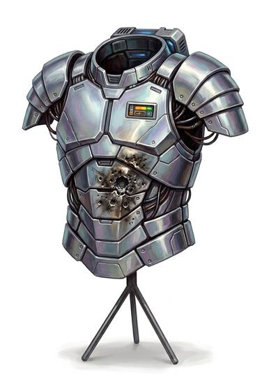

# Ablative armour

{.illus}

*Set: Expansion*

*aka: ______________________________*

Plates of a special compound, layered over the chest and arms, that burn, boil and flake away when struck by a beam of energy. Each hit carries off a layer and the heat with it, leaving the wearer shaken but unburned. After a fight, it looks like scorched bark.

It is made against energy weapons and does that very well, but only a few times; after that it is gone. Against bullets and blades it is ordinary armour, no better than a good vest. Troops fighting energy weapons carry spare plates.

## Game block

- **Value:** 4
- **Zones:** torso, arms
- **Wear:** 4, brittle
- **Dodge penalty:** −1
- **Needs:** far future
- **Weight:** 6 kg
- **Price:** 25 S
- **Notes:** burns away to stop energy weapons; value 6 against bullets and blades

## Not to be confused with

*[Personal energy shield](personal-energy-shield.md)*, which also stops energy but recharges; ablative armour is consumed and must be replaced.

