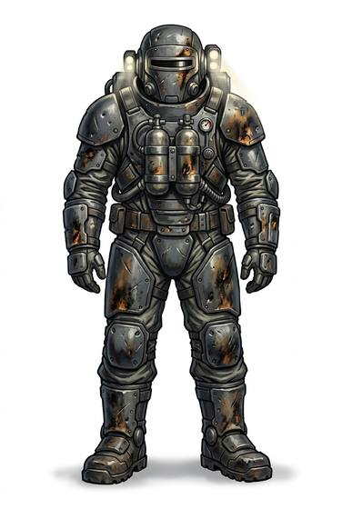

# Armoured vacuum suit

{.illus}

*Set: Expansion*

*aka: ______________________________*

A vacuum suit reinforced with hard plates over the chest, back, shoulders and limbs, and a thicker helmet. It is worn by boarding crews, mining teams on dangerous rock and ship's security. It keeps the wearer alive in space and makes it less likely that a stray shot will end that.

The plates add bulk, and moving in zero gravity takes practice. The joints are still the weak spots. A good hit that cracks the seal is still a very bad day.

## Game block

- **Value:** 3
- **Zones:** all zones
- **Wear:** 12
- **Dodge penalty:** −2
- **Needs:** spaceflight
- **Weight:** 15 kg
- **Price:** 20 G
- **Notes:** a vacuum suit with hard plates

## Not to be confused with

*[Vacuum suit](vacuum-suit.md)*, the unarmoured version; *[Combat hardsuit](combat-hardsuit.md)*, the fully military model made for war.

