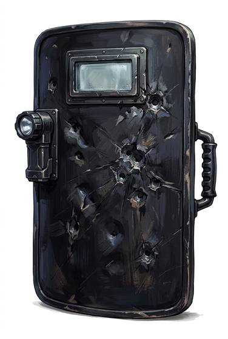

# Ballistic shield

{.illus}

*Set: Expansion*

*aka: ______________________________*

A heavy, dark shield of layered fibre and steel or ceramic, with a small armoured window near the top. Entry teams carry it through doorways, and a pistol round fired at it lands with a bang and goes nowhere. The first person through the door carries it; everyone else stacks up behind.

It is exhausting to hold for long and makes the bearer slow and clumsy. The window is small, the edge snags on door frames, and a rifle round still punches through. But against a frightened man with a handgun, it is a great deal of comfort.

## Game block

- **Parry bonus:** +2 (a shield is not armour; it adds to Parry and parries missiles)
- **Cover:** heavy (-4), stops pistol rounds
- **Needs:** computing
- **Weight:** 8 kg
- **Price:** 20 S
- **Notes:** modern; heavy, -2 Dodge

## Not to be confused with

*[Riot shield](riot-shield.md)*, which is clear and light but won't stop anything more serious than a thrown brick.

