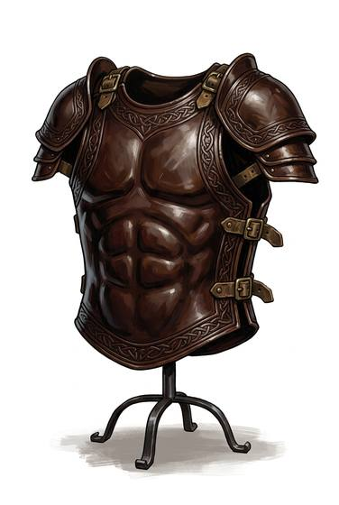

# Boiled leather

{.illus}

*Set: Core*

*aka: ______________________________*

Thick leather soaked, shaped over a wooden form and hardened with heat, wax or oil until it is nearly as stiff as horn. Once set, it keeps its shape: a breastplate, curved guards for the forearms and shins, plates for the thighs. It can be painted, tooled and polished, and often is, because it is cheap enough to show off in.

It turns a slash and spreads the shock of a blow better than cloth. A good thrust still finds its way through. Rain softens it, sun cracks it, and the wearer creaks faintly with every step.

## Game block

- **Value:** 1
- **Zones:** torso, arms, legs
- **Wear:** 8
- **Dodge penalty:** 0
- **Weight:** 6 kg
- **Needs:** agriculture
- **Price:** 30 S
- **Notes:** stiffened leather cuirass and limbs

## Not to be confused with

*[Hide](hide.md)*, which is the same material left soft; boiled leather is hardened into shaped plates that hold their form.

