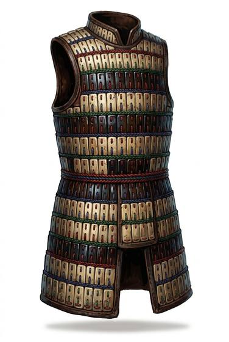

# Bone or wooden lamellar

{.illus}

*Set: Expansion*

*aka: ______________________________*

Small slats of bone, horn, antler or hard wood, drilled at the edges and laced together in rows with rawhide or sinew. The rows overlap, and the whole thing wraps the chest like a stiff, clattering vest. Steppe riders, island warriors and northern hunters have all made it from whatever their land gave them.

It turns arrows well and a blade reasonably, but it is rigid, and the lacing is its weakness: cut enough thongs and the slats spill loose. It rattles with every step. A warrior who wants to move quietly takes it off first.

## Game block

- **Value:** 2
- **Zones:** torso
- **Wear:** 8
- **Dodge penalty:** −1
- **Weight:** 7 kg
- **Needs:** agriculture
- **Price:** 25 S
- **Notes:** slats laced together; steppe and island peoples

## Not to be confused with

*[Scale or metal lamellar](scale-or-metal-lamellar.md)*, which uses the same laced construction with metal plates; it is heavier and much harder to break.

