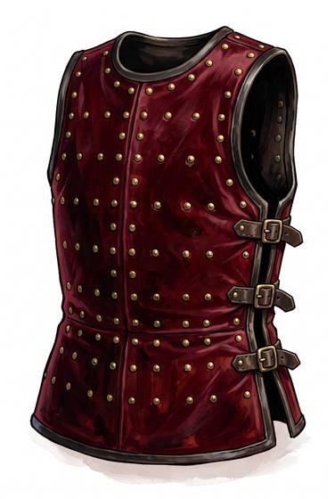

# Brigandine

{.illus}

*Set: Expansion*

*aka: ______________________________*

A doublet of heavy cloth or leather, often dyed and fancy on the outside, with dozens of small steel plates riveted inside. The rows of rivet heads on the surface give it away. It is the armour of soldiers who need to look like gentlemen, and gentlemen who need to fight like soldiers.

It bends with the body far better than a solid breastplate and covers the torso well against cuts and thrusts. A plate that works loose can be replaced by any armourer in an afternoon. Its owners tend to wear it until it falls apart, and then have it relined.

## Game block

- **Value:** 2
- **Zones:** torso
- **Wear:** 20
- **Dodge penalty:** −1
- **Weight:** 9 kg
- **Needs:** iron
- **Price:** 10 G
- **Notes:** cloth or leather lined with small plates

## Not to be confused with

*[Coat of plates](coat-of-plates.md)*, its older and cruder ancestor, with fewer and larger plates; the brigandine uses many small ones for a better fit.

