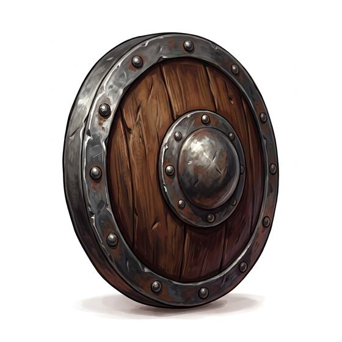

# Buckler

{.illus}

*Set: Core*

*aka: ______________________________*

A small round shield, no bigger than a dinner plate, held in the fist by a single grip behind the central boss. It covers almost nothing on its own. Its purpose is to be moved: punched out to meet a blade, used to trap an opponent's weapon, or swung to hit the enemy's hand or face.

Fencers, duellists and townsmen carry one hung from the belt beside the sword. It is no use against arrows or in a line of battle, but in a street fight it is fast, light, and always within reach.

## Game block

- **Parry bonus:** +1 (a shield is not armour; it adds to Parry and parries missiles)
- **Cover:** none
- **Needs:** bronze
- **Weight:** 1 kg
- **Price:** 8 S
- **Notes:** small fist shield; quick but covers little

## Not to be confused with

*[Round shield](round-shield.md)*, which is larger and covers the body; the buckler is a fencing tool that must be moved to work.

