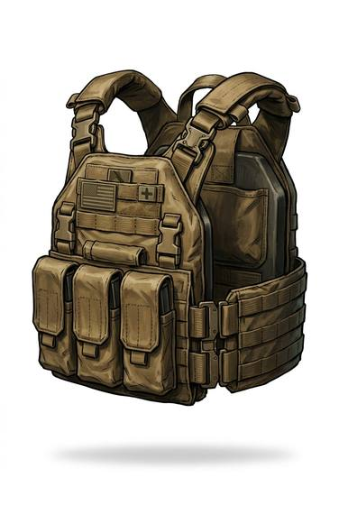

# Ceramic rifle plate (in a carrier)

{.illus}

*Set: Core*

*aka: ______________________________*

A plate of hard ceramic backed with layers of fibre, carried in the front and back pockets of a vest. When a rifle bullet strikes, the ceramic shatters and breaks the bullet with it, and the backing catches what is left. It is lighter than steel and stops more.

The price is that each hit cracks it, and a plate that has taken a few rounds, or been dropped on concrete, may fail on the next. Soldiers check their plates after every fight, and armies throw them away by the thousand.

## Game block

- **Value:** 4
- **Zones:** torso
- **Wear:** 6, brittle
- **Dodge penalty:** −2
- **Weight:** 3 kg per plate
- **Needs:** computing
- **Price:** 4 S
- **Notes:** stops rifle rounds, but only five or six before it cracks

## Not to be confused with

*[Steel rifle plate](steel-rifle-plate.md)*, which is heavier but takes many hits without failing.

