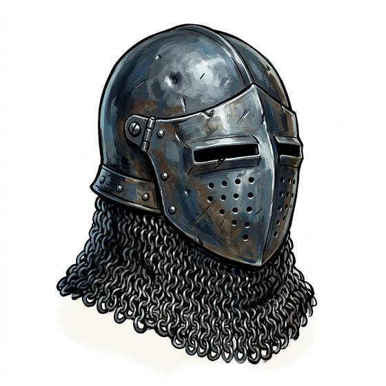

# Closed helm

{.illus}

*Set: Core*

*aka: ______________________________*

A helmet that encloses the whole head, with a fixed face plate pierced for sight and breathing. It turns a blow to the face that would have ended a warrior in an open helmet. It also makes the world small, dim and muffled. The wearer hears their own breath loudest, and must turn the whole head to look to either side.

Soldiers in closed helms learn to trust their comrades' voices and to move carefully. Some knock holes in it for air, and regret it later.

## Game block

- **Value:** 3
- **Zones:** head
- **Wear:** 35
- **Needs:** iron
- **Weight:** 3 kg
- **Price:** 15 G
- **Notes:** -1 Perception while worn

## Not to be confused with

*[Great helm or visored helmet](great-helm-or-visored-helmet.md)*, which gives even more protection with a narrower view; the closed helm is a compromise.

