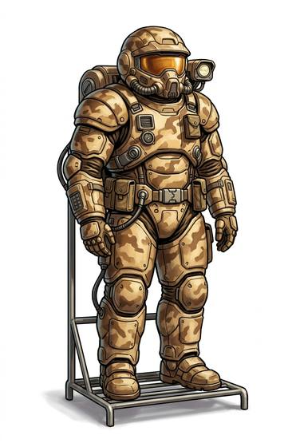

# Combat hardsuit

{.illus}

*Set: Expansion*

*aka: ______________________________*

Sealed military armour of composite plates over a pressure layer, with its own air supply, a helmet full of screens, and a heating and cooling system. Soldiers wear it on hostile worlds, in poisoned air, on boarding actions and in open space. It stops most small arms and keeps the wearer alive in places no one should be.

It is heavy without the motors that powered armour has, and wearers must be fit. The helmet shows a map, the positions of friends and a warning when the air runs low.

## Game block

- **Value:** 4
- **Zones:** all zones
- **Wear:** 25
- **Dodge penalty:** −2
- **Needs:** spaceflight
- **Weight:** 20 kg
- **Price:** 10 G
- **Notes:** sealed military armour

## Not to be confused with

*[Powered armour](../Skills/powered-armour.md)*, which has motors to carry the weight and much more protection; the hardsuit relies on the wearer's own strength.

