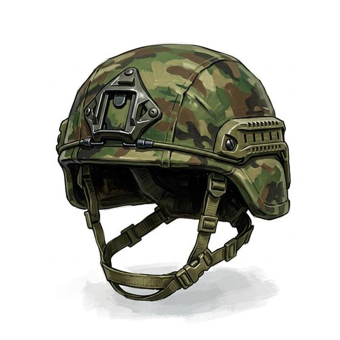

# Combat helmet

{.illus}

*Set: Core*

*aka: ______________________________*

A rounded helmet of layered fibre or composite, with a padded lining and a chin strap, cut high at the ears to leave room for a radio. It has replaced steel helmets in most modern armies because it is lighter and stops more. Shell splinters bounce off it; some pistol rounds do too.

Rails on the sides carry lights and a mount for night-vision goggles. A rifle round will still get through, and a blast will still stun the head inside it. Soldiers write names, jokes and prayers on the cover.

## Game block

- **Value:** 3
- **Zones:** head
- **Wear:** 12
- **Dodge penalty:** 0
- **Weight:** 1.5 kg
- **Needs:** electricity
- **Price:** 3 S
- **Notes:** fibre or composite; stops fragments and some pistol rounds

## Not to be confused with

*[Open metal helmet](open-metal-helmet.md)*, the old steel bowl; the combat helmet is lighter, stops much more, and carries gear.

