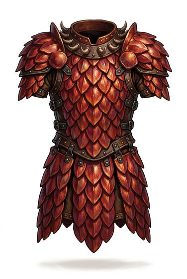

# Dragon-scale armour

{.illus}

*Set: Expansion*

*aka: ______________________________*

Armour made from the scales of a great dragon, each one as broad as a hand, stitched or riveted to a leather backing. The scales are harder than steel and the colour of the beast that shed them. They still carry the dragon's resistance to fire, which makes the wearer hard to burn as well as hard to cut.

Only a dragon slayer, or someone rich enough to buy from one, owns such a thing. It is heavy, beautiful and eerie, and other dragons are said to smell it from a long way off.

## Game block

- **Value:** 3
- **Zones:** torso, arms, legs
- **Wear:** 50
- **Dodge penalty:** −2
- **Needs:** —
- **Weight:** 12 kg
- **Price:** 2000 G
- **Notes:** also halves fire damage

## Not to be confused with

*[Scale or metal lamellar](scale-or-metal-lamellar.md)*, the ordinary scale armour of soldiers, which has none of the dragon's resistance to fire.

