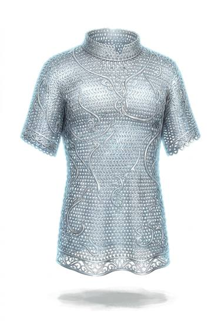

# Enchanted mail

{.illus}

*Set: Expansion*

*aka: ______________________________*

A shirt of ordinary-looking mail with a protective spell bound into the rings. Sometimes the enchantment is worked into every link as it is closed; sometimes a single rune is stamped on a ring near the heart. The rings never rust, never break, and turn blows that would burst ordinary mail.

Most such shirts have a history, and many have a name. Families hand them down, thieves steal them, and heroes are buried in them, which leads to further stories.

## Game block

- **Value:** 3
- **Zones:** torso, arms
- **Wear:** never wears
- **Dodge penalty:** −2
- **Needs:** —
- **Weight:** 10 kg
- **Price:** 200 G
- **Notes:** mail with a protective enchantment

## Not to be confused with

*[Mail shirt](mail-shirt.md)*, the ordinary version, which rusts and wears out; *[Star-metal mail](star-metal-mail.md)*, lighter still.

