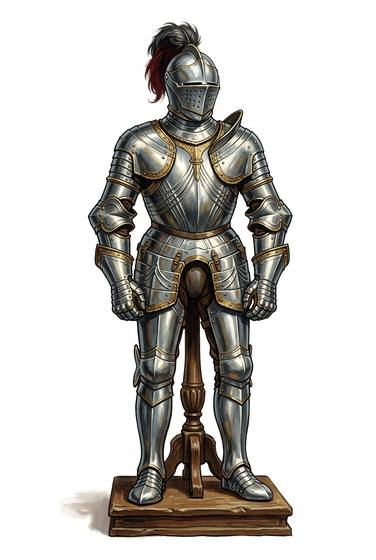

# Full plate harness

{.illus}

*Set: Core*

*aka: ______________________________*

Fitted steel from neck to foot, each piece shaped to one wearer, hinged and strapped so that it moves with every joint. A fit knight can mount a horse, run and roll on the ground in it. It takes a master armourer many months and costs as much as a farm. The weight is spread over the whole body, so it tires the wearer less than people expect, though it is hot.

Swords barely scratch it. Arrows skid off. The wearer's enemies learn to use hammers, poleaxes and daggers pushed through the joints. A fallen knight can't easily be killed, but he can be held down and ransomed.

## Game block

- **Value:** 4
- **Zones:** torso, arms, legs
- **Wear:** 40
- **Dodge penalty:** −4
- **Weight:** 25 kg
- **Needs:** iron
- **Price:** 200 G
- **Notes:** fitted steel from head to foot (add a helmet for the head)

## Not to be confused with

*[Half plate](half-plate.md)*, which covers only the torso and arms; lighter and cheaper, but the legs are exposed.

