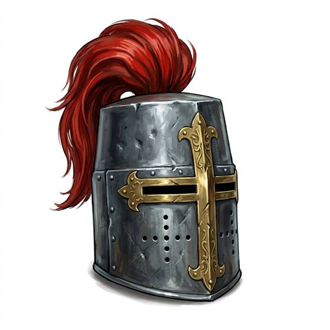

# Great helm or visored helmet

{.illus}

*Set: Expansion*

*aka: ______________________________*

A tall cylinder of steel with only a narrow slit for the eyes, or a later helmet with a hinged visor that can be raised between fights. It is made for the charge, when a lance point is coming at the face and there is nothing to lose by seeing less. Painted and crested, it also makes its wearer impossible to mistake at a tournament.

Inside it is hot, dark and loud. The eye slit is the one gap, and a skilled opponent knows exactly where it is. Knights often wear it only for the first clash.

## Game block

- **Value:** 4
- **Zones:** head
- **Wear:** 40
- **Needs:** iron
- **Weight:** 4 kg
- **Price:** 20 G
- **Notes:** -2 Perception while worn; the eye slit is a vital gap

## Not to be confused with

*[Closed helm](closed-helm.md)*, which offers slightly less protection but lets the wearer see and hear more.

