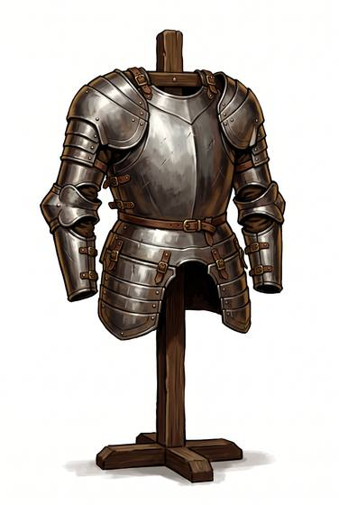

# Half plate

{.illus}

*Set: Core*

*aka: ______________________________*

A solid breastplate and backplate, with shaped steel over the shoulders and arms, leaving the legs in mail, leather or nothing at all. It is the armour of infantry officers, pikemen and mounted soldiers who fight on the move and can't carry a full harness. It is quicker to put on, quicker to take off, and easier to pay for.

The breastplate turns almost anything short of a bullet, and in later ages a proof mark shows it was tested against one. The legs remain the target. Wise wearers learn to keep them behind a shield, a horse's neck or a friend.

## Game block

- **Value:** 3
- **Zones:** torso, arms
- **Wear:** 35
- **Dodge penalty:** −3
- **Weight:** 18 kg
- **Needs:** iron
- **Price:** 80 G
- **Notes:** breastplate and arm defences

## Not to be confused with

*[Full plate harness](full-plate-harness.md)*, which encloses the legs as well and is heavier and far more costly.

