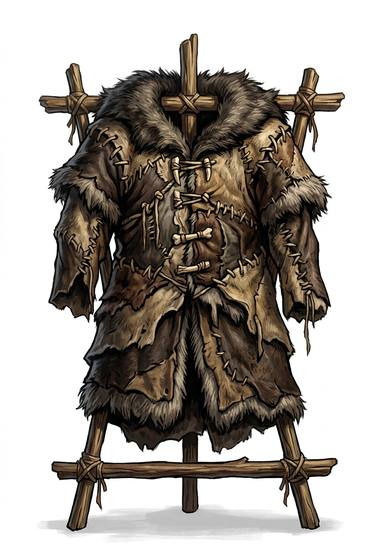

# Hide

{.illus}

*Set: Core*

*aka: ______________________________*

The tanned or half-tanned skin of a big animal, cut into a tunic, leggings and sleeves, and laced up the sides. It is what a hunting people make when the herd has been kind to them. Bison, elk, walrus and bear all end up on someone's back. The thick hide of the neck and shoulders goes over the chest, where it is needed most.

It stops a flint point that comes in at an angle and blunts the edge of a bronze knife. It stiffens in the cold, stinks in the heat, and needs grease to stay supple. Frontier folk who can't afford metal still wear it.

## Game block

- **Value:** 1
- **Zones:** torso, arms, legs
- **Wear:** 6
- **Dodge penalty:** 0
- **Weight:** 6 kg
- **Needs:** stone tools
- **Price:** 8 S
- **Notes:** tribal and frontier armour

## Not to be confused with

*[Boiled leather](boiled-leather.md)*, which is hardened in hot water or wax into rigid plates; hide stays soft and flexible.

