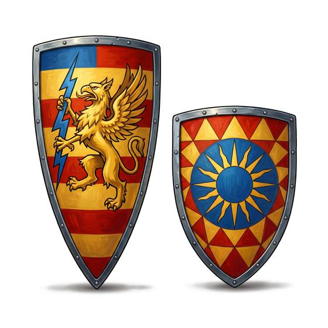

# Kite or heater shield

{.illus}

*Set: Core*

*aka: ______________________________*

A tall shield, broad at the top and pointed at the bottom, made so a mounted warrior can protect the whole left side from shoulder to knee without the rim getting in the reins. The long kite shape came first; the shorter, flatter heater followed as armour improved. Both are painted with the owner's device, so a herald can tell who is who.

On foot, it covers more than a round shield but is awkward to swing. On horseback, it is the knight's shield, held on a strap around the neck when the hands are busy.

## Game block

- **Parry bonus:** +3 (a shield is not armour; it adds to Parry and parries missiles)
- **Cover:** partial
- **Needs:** iron
- **Weight:** 5 kg
- **Price:** 20 S
- **Notes:** good from horseback

## Not to be confused with

*[Round shield](round-shield.md)*, which is smaller and quicker to move, but doesn't cover the leg of a rider.

