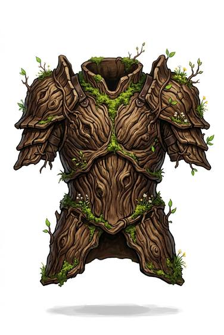

# Living bark armour

{.illus}

*Set: Expansion*

*aka: ______________________________*

Armour grown, not made: a living plant coaxed by druids or forest folk to wrap the wearer's body in plates of hard bark, with roots for straps and leaves at the joints. It smells of sap and moss, creaks like a tree in the wind, and bears flowers in spring.

It protects well, and when damaged it grows back, as long as it has light, water and a little time. It must be fed, and it may take root if the wearer stands still too long.

## Game block

- **Value:** 2
- **Zones:** torso, arms, legs
- **Wear:** regrows
- **Dodge penalty:** −1
- **Needs:** —
- **Weight:** 8 kg
- **Price:** 300 G
- **Notes:** grown, not made; heals one wear per day in sunlight

## Not to be confused with

*[Hide](hide.md)*, which is also made from the natural world; but bark armour is alive and heals itself.

