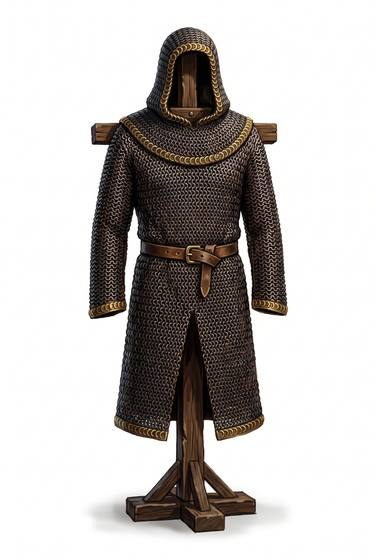

# Mail hauberk

{.illus}

*Set: Expansion*

*aka: ______________________________*

A long coat of thousands of small iron rings, each one linked through four others and closed with a rivet. It hangs to the knees, has sleeves to the wrist, and is worn over a padded coat, because mail stops a blade but not the bruise behind it. Making one takes a smith and an apprentice most of a year. Owning one says a family has land.

Mail is at its best against the cut. A sword slides across it, and an axe bites but rarely through. A spear point or a heavy arrow can burst the rings, and a mace simply breaks the bones underneath. It is hot, it rusts if neglected, and it pulls on the shoulders until a belt takes some of the weight at the hips.

## Game block

- **Value:** 2
- **Zones:** torso, arms, legs
- **Wear:** 30
- **Dodge penalty:** −2
- **Weight:** 14 kg
- **Needs:** iron
- **Price:** 30 G
- **Notes:** long mail coat with sleeves and skirt

## Not to be confused with

the *[Mail shirt](mail-shirt.md)*, which is the same armour cut short at the waist and elbow: lighter, but it leaves the legs bare.

