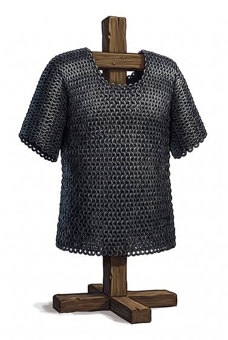

# Mail shirt

{.illus}

*Set: Core*

*aka: ______________________________*

A shirt of interlinked iron rings, cut short at the waist and elbow, worn over a padded coat. It is lighter and cheaper than the long coat and far easier to march in. Men-at-arms, caravan guards and sergeants who can't afford a whole hauberk make do with one, and so do knights who expect to fight on foot.

Like all mail, it shrugs off the cut and suffers from the thrust and the blunt blow. It leaves the thighs and forearms bare, and experienced opponents aim for them. It needs oil and sand to keep the rust away.

## Game block

- **Value:** 2
- **Zones:** torso, arms
- **Wear:** 30
- **Dodge penalty:** −2
- **Weight:** 10 kg
- **Needs:** iron
- **Price:** 20 G
- **Notes:** the classic chainmail; strong against cuts, weaker against crushing

## Not to be confused with

*[Mail hauberk](mail-hauberk.md)*, which is the same armour made long, reaching the knees and wrists; heavier, but it protects the legs.

