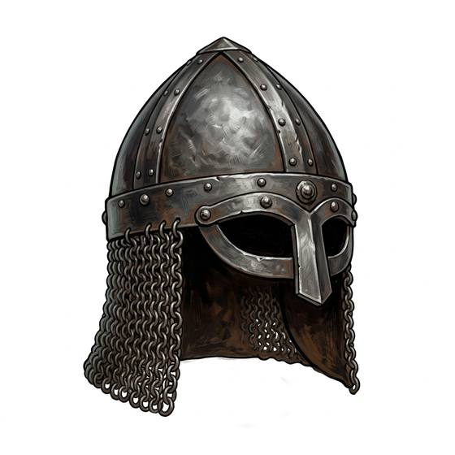

# Open metal helmet

{.illus}

*Set: Core*

*aka: ______________________________*

A bowl of iron or bronze, sometimes with a nose guard or cheek flaps, open at the face. It is the most common helmet in history. It keeps a sword off the skull, lets the wearer see and breathe freely, and allows a shouted order to be heard. Foot soldiers, sailors and cavalry have all preferred it to anything heavier.

The open face is its weakness. An enemy who knows it aims for the eyes and mouth, and a scar across the cheek is the veteran's badge. It rings like a bell when struck, which is unpleasant for the wearer.

## Game block

- **Value:** 2
- **Zones:** head
- **Wear:** 25
- **Needs:** bronze
- **Weight:** 2 kg
- **Price:** 30 S
- **Notes:** the face is exposed; face hits count as a vital gap

## Not to be confused with

*[Closed helm](closed-helm.md)*, which covers the face too, but at the cost of sight and hearing.

