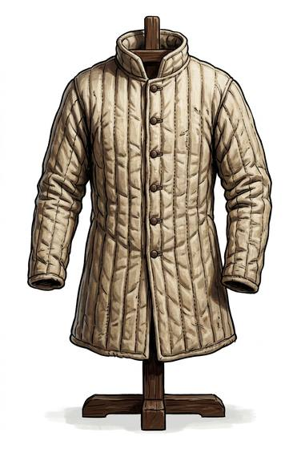

# Padded jack / gambeson

{.illus}

*Set: Core*

*aka: ______________________________*

A coat of linen or wool stuffed with rags, tow or raw fleece and stitched in rows so the filling can't slide. It is the poor soldier's whole armour and the rich soldier's foundation. Worn alone, it soaks up the sting of a club and stops a tired cut. Worn under mail, it takes the bruise that the rings pass on.

It is hot in summer, heavy when wet, and slow to dry. Every army that ever marched has had a line of men in quilted coats, sweating and grumbling, and still alive.

## Game block

- **Value:** 1
- **Zones:** torso, arms
- **Wear:** 5
- **Dodge penalty:** 0
- **Weight:** 4 kg
- **Needs:** agriculture
- **Price:** 20 S
- **Notes:** worn alone or under mail (+1)

## Not to be confused with

*[Quilted cotton armour](quilted-cotton-armour.md)*, which is thicker and stiffer, made to be the only armour a warrior wears rather than a layer beneath mail.

