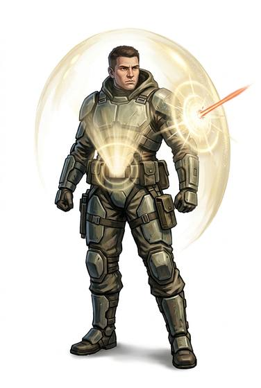

# Personal energy shield

{.illus}

*Set: Core*

*aka: ______________________________*

A small device worn on the belt or wrist that surrounds the body with a shimmering field of force. Fast things, like bullets, beams and shrapnel, strike the field and stop. Slow things, like a knife pushed with patience, a hand or a mouthful of air, pass straight through, which is how the wearer breathes.

It holds for a few good hits and then drops, flickering, until the power cell has had time to recover. Duellists learn to fight slowly against it. It makes a faint hum and a smell like a summer storm.

## Game block

- **Value:** 3
- **Zones:** all zones
- **Wear:** 3, brittle
- **Dodge penalty:** 0
- **Needs:** far future
- **Weight:** 1 kg
- **Price:** 100 G
- **Notes:** a field around the body; fully recharges after a short rest; doesn't stop slow-moving blades or hands

## Not to be confused with

*[Ablative armour](ablative-armour.md)*, which also stops energy weapons but burns away and must be replaced; the shield recharges.

