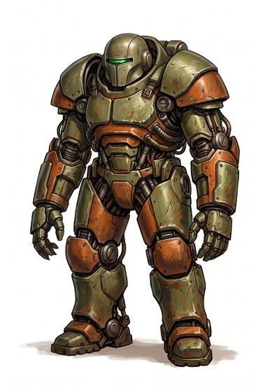

# Powered armour

{.illus}

*Set: Expansion*

*aka: ______________________________*

A walking fortress: a suit of heavy armour plates hung on a frame of motors, cables and joints that move when the wearer moves. It carries its own weight and more. A soldier inside can lift a heavy gun as easily as a rifle, run through walls and walk through fire.

It is loud, needs a great deal of power, and takes a team of technicians to keep running. Its sheer size makes it easy to spot. On a battlefield, it is the closest thing a soldier can be to a war machine.

## Game block

- **Value:** 5
- **Zones:** all zones
- **Wear:** 40
- **Dodge penalty:** 0
- **Needs:** far future
- **Weight:** 80 kg (carried by its motors)
- **Price:** 300 G
- **Notes:** motors carry the weight; the wearer counts as strong enough for any weapon's Strength number

## Not to be confused with

*[Combat hardsuit](combat-hardsuit.md)*, which is lighter and has no motors; its wearer carries it on their own strength.

