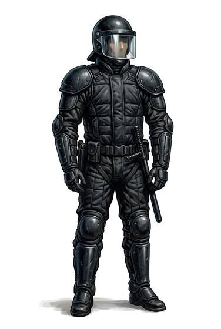

# Riot gear

{.illus}

*Set: Expansion*

*aka: ______________________________*

A full set of hard plastic shells over padding: chest and back plates, shoulder cups, forearm and shin guards, and gloves with armoured knuckles. It is made to let a line of officers stand in front of an angry crowd for hours and walk away bruised but whole. Worn with a helmet and a shield, it turns the wearer into something that looks more like an insect than a person.

It stops clubs, stones, bottles and boots. It is hot, bulky and slow, and a real firearm makes short work of it.

## Game block

- **Value:** 2
- **Zones:** torso, arms, legs
- **Wear:** 15
- **Dodge penalty:** −2
- **Weight:** 10 kg
- **Needs:** computing
- **Price:** 8 S
- **Notes:** padding and hard shells against clubs and thrown objects

## Not to be confused with

*[Motorcycle leathers](motorcycle-leathers.md)*, which are lighter and made for scrapes; riot gear is hard-shelled and made to take blows.

