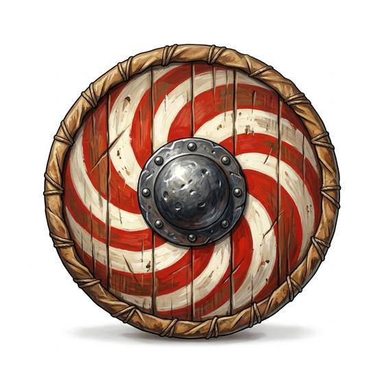

# Round shield

{.illus}

*Set: Core*

*aka: ______________________________*

A disc of planks, as wide as the bearer's forearm is long, covered in hide and rimmed with iron or rawhide, with an iron boss in the centre over the hand. It is simple to make, easy to carry on the back, and effective wherever men fight in lines. Sea raiders, hill clansmen and city militias have all used it.

It stops blows, catches arrows and can be locked edge to edge with neighbours into a wall. It splits under a good axe, so warriors carry spares. A split shield is often the moment a fight turns.

## Game block

- **Parry bonus:** +2 (a shield is not armour; it adds to Parry and parries missiles)
- **Cover:** partial (-2 to be hit by arrows and thrown weapons)
- **Needs:** agriculture
- **Weight:** 4 kg
- **Price:** 10 S
- **Notes:** the common shield of most eras

## Not to be confused with

*[Kite or heater shield](kite-or-heater-shield.md)*, which is taller and shaped for a rider's leg; the round shield is simpler and made for foot soldiers.

