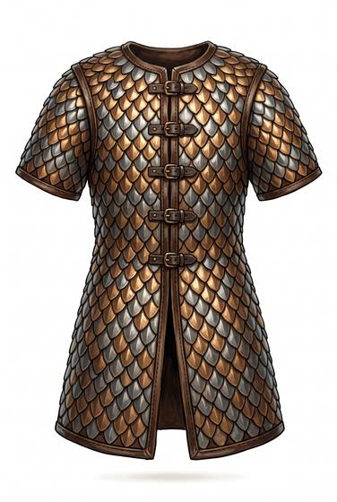

# Scale or metal lamellar

{.illus}

*Set: Expansion*

*aka: ______________________________*

Hundreds of small plates of bronze, iron or steel, either sewn to a backing like the scales of a fish or laced to each other in rigid rows. It glitters in the sun and rustles like dry leaves when the wearer moves. Old river empires armed their charioteers in it, and horse archers of the grasslands have worn it for as long as they have had metal.

It turns cuts and arrows well and spreads the shock of a blow. An upward thrust can slip under the scales, and the lacing needs constant repair. It is heavy, and it makes the wearer slower than mail does.

## Game block

- **Value:** 3
- **Zones:** torso, arms
- **Wear:** 25
- **Dodge penalty:** −2
- **Weight:** 13 kg
- **Needs:** bronze
- **Price:** 30 G
- **Notes:** overlapping metal plates

## Not to be confused with

*[Bone or wooden lamellar](bone-or-wooden-lamellar.md)*, the same construction in lighter, weaker materials.

