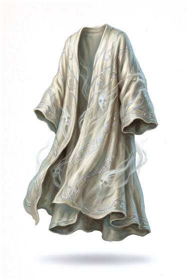

# Spirit-woven robe

{.illus}

*Set: Expansion*

*aka: ______________________________*

A robe of plain-looking cloth woven by a shaman, a spirit-priest or a fae weaver, with charms, feathers or knots worked into the hem. Against a sword, it is little better than a heavy coat. Against a curse, a ghost's cold touch or a hostile spell, it turns thick and strong, like a closed door.

Mystics and exorcists wear it on their errands into haunted places. It is light, quiet and easy to move in. Many weavers say that the spirits themselves help make it, and demand payment.

## Game block

- **Value:** 1
- **Zones:** torso, arms, legs
- **Wear:** 10
- **Dodge penalty:** 0
- **Needs:** —
- **Weight:** 1 kg
- **Price:** 150 G
- **Notes:** value 8 against spirits and magical attacks

## Not to be confused with

*[Blessed plate](blessed-plate.md)*, which also guards against unnatural foes, but is heavy metal armour; the robe is light cloth.

