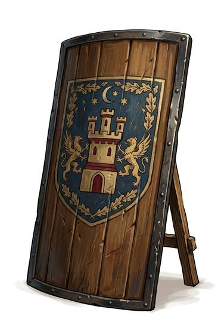

# Tower shield or large pavise

{.illus}

*Set: Core*

*aka: ______________________________*

A shield as tall as a man, rectangular or curved, often with a spike or a prop so it can stand on its own. Crossbowmen shelter behind a pavise while they reload; soldiers in the front rank of a slow advance hold a tower shield as a moving wall. Arrows thud into it by the dozen and go no farther.

It is heavy, slow and tiring to carry. The bearer can see little over it, and moving quickly is out of the question. But against a storm of missiles, it is the difference between marching forward and lying in the mud.

## Game block

- **Parry bonus:** +4 (a shield is not armour; it adds to Parry and parries missiles)
- **Cover:** heavy (-4)
- **Needs:** bronze
- **Weight:** 10 kg
- **Price:** 30 S
- **Notes:** slow, -1 Dodge

## Not to be confused with

*[Kite or heater shield](kite-or-heater-shield.md)*, which is lighter and easier to fight with but gives much less cover.

