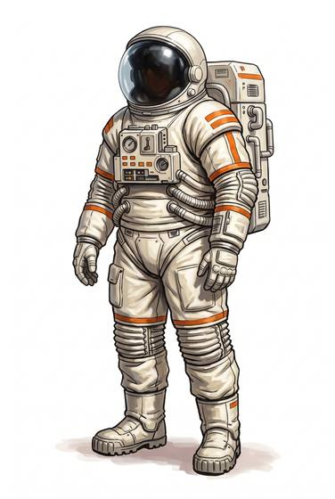

# Vacuum suit

{.illus}

*Set: Expansion*

*aka: ______________________________*

A sealed suit of layered fabric with a clear helmet, gloves and boots, and a pack of air and power on the back. It lets its wearer survive where there is no air: outside a ship, on an airless moon, or in a hull that has been holed. Every crew member has one within arm's reach, and drills to put it on in the dark.

It is no armour to speak of. A knife or a bullet that tears it turns into a desperate race to seal the rip before the air runs out.

## Game block

- **Value:** 1
- **Zones:** all zones
- **Wear:** 3
- **Dodge penalty:** −1
- **Needs:** spaceflight
- **Weight:** 8 kg
- **Price:** 60 S
- **Notes:** keeps you alive in space; a tear is an emergency

## Not to be confused with

*[Armoured vacuum suit](armoured-vacuum-suit.md)*, which adds hard plates and can take a hit; this one is for survival, not a fight.

