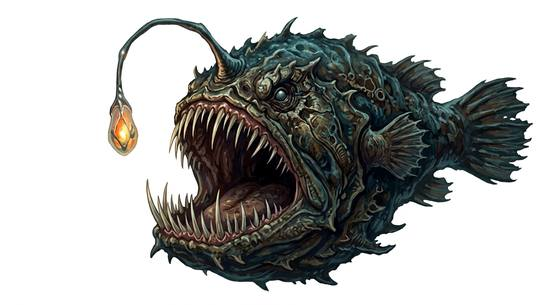

# Abyssal anglerfish

{.illus}

*Set: Expansion*

*aka: ______________________________*

*[Aquatic](../Species_Families/aquatic.md) · huge swimmer · swimmer · fantasy, horror*

A deep-sea fish of nightmare size, all mouth and needle teeth, with a glowing lure dangling on a long stalk from its forehead. In the black water of the abyss that little light is the only thing to see, and everything that lives there is drawn to it.

It does not chase. It hangs still, lure swaying, and when anything comes close enough its jaws snap open and it swallows the prey whole. Divers and deep-sea vessels are only prey that happens to glow differently. It has no mind to speak of and never flees. The best advice for anyone in the deep is simple: do not follow lights.

## Stat block

- **Attack** 18 · **Parry** — · **Dodge** 3 · **Armour** 2 · **Life** 38 · **Threat** 3
- **Attacks (2 a round):** great bite 2d6+1
- **Attributes:** STR 20 DEX 8 AGI 8 END 20 INT 2 WIS 10 PER 14 CHA 3 COU 16
- **Skills:** [Stealth](../Skills/stealth.md) +5 (reroll 1)
- **Powers:** [Light](../Powers/light.md) 2, [Night & Spectrum Sight](../Powers/night-and-spectrum-sight.md) 3, [Water Breathing](../Powers/water-breathing.md) 5
- **Behaviour:** dangles a lure in the dark; swallows whatever approaches. **Morale:** mindless, never flees.

How to read this block: [Bestiary](../bestiary.md).

## Not to be confused with

the *[whirlpool maw](whirlpool-maw.md)*, a stationary mouth in the seabed; the anglerfish is a swimming fish that lures its prey with light.

