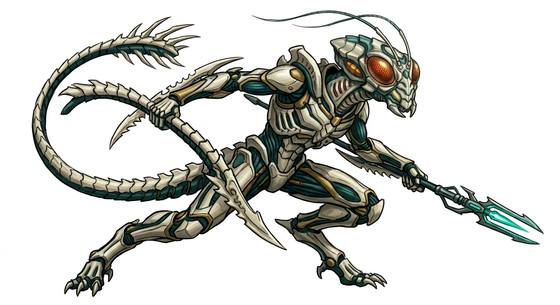

# Acid-blooded hive stalker

{.illus}

*Set: Expansion*

*aka: ______________________________*

*[Hive and collective](../Species_Families/hive-and-collective.md) · large biped · climber · sci-fi, horror*

A tall, black, biomechanical hunter, taller than a man, with a long, smooth skull, a second set of jaws that shoots out from its mouth, and a long, bladed tail. Its blood is acid that eats through steel, so wounding it is dangerous to anyone close. It hunts through vents, ducts and shafts, and drags its victims back to the nest.

It fights to the death. Those who have faced one describe it as the perfect hunter, patient, silent and utterly without mercy. The only safe way to deal with it is from a distance, and preferably with fire.

## Stat block

- **Attack** 22 (rerolls 1) · **Parry** 19 · **Dodge** 13 · **Armour** 2 · **Life** 28 · **Threat** 5+
- **Attacks (2 a round):** inner jaw 1d6+2; claws 1d6+2; tail 1d6+2
- **Attributes:** STR 18 DEX 17 AGI 17 END 16 INT 6 WIS 14 PER 14 CHA 2 COU 18
- **Skills:** [Stealth](../Skills/stealth.md) +5 (reroll 2), [Climbing](../Skills/climbing.md) +5 (reroll 2), [Tracking](../Skills/tracking.md) +5
- **Powers:** [Acid & Corrosion](../Powers/acid-and-corrosion.md) 2, [Wall Walking](../Powers/wall-walking.md) 2
- **Behaviour:** hunts through vents; drags victims back to the nest. **Morale:** fights to the death.

How to read this block: [Bestiary](../bestiary.md).

## Not to be confused with

*[Warrior hive bug](warrior-hive-bug.md)*, a hive-dwelling insect soldier, where the hive stalker is a sleek, acid-blooded hunter that climbs through vents.

