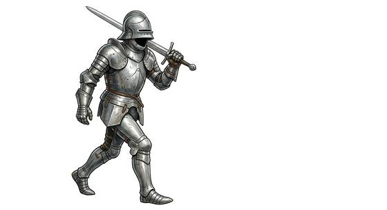

# Animated armour

{.illus}

*Set: Expansion*

*aka: ______________________________*

*[Constructs and synthetics](../Species_Families/constructs-and-synthetics.md) · medium biped · walk · fantasy, horror*

An empty suit of plate armour standing among other displays in a great hall or an armoury. Nothing inside it, no ghost, only a spell that makes it fight as if its old owner still wore it. It stands perfectly still until an intruder turns their back, then draws its sword and strikes.

It fights with a knight's skill and never tires. It is mindless and never flees. Its weaknesses are those of any armour with no one inside it: smash the joints and it falls apart, and it cannot open a door it was not told to open. Wizards and paranoid nobles like them because they need no feeding, no wages and no sleep.

## Stat block

- **Attack** 18 · **Parry** 15 · **Dodge** 7 · **Armour** 3 · **Life** 22 · **Threat** 2
- **Attacks:** held blade 1d6+1; gauntlet blow 1d6+1
- **Attributes:** STR 14 DEX 10 AGI 10 END 14 INT 1 WIS 8 PER 8 CHA 1 COU 20
- **Skills:** [Swords](../Weapon_Groups/swords.md) +4, [Shields](../Weapon_Groups/shields.md) +3
- **Powers:** [Toughness](../Powers/toughness.md) 1
- **Behaviour:** stands among displays until an intruder turns away. **Morale:** mindless, never flees.

How to read this block: [Bestiary](../bestiary.md).

## Not to be confused with

*[Haunted armour](haunted-armour.md)*, a suit walked by a restless ghost; animated armour is moved by a spell, with no spirit inside it.

