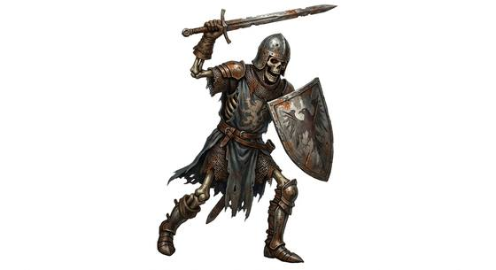

# Armoured skeleton knight

{.illus}

*Set: Expansion*

*aka: ______________________________*

*[Undead and deathless](../Species_Families/undead-and-deathless.md) · medium biped · walk · fantasy, horror*

A skeleton still wearing the rusted mail and dented helm of its lifetime, with a sword in one hand and a battered shield in the other. Through the gaps in its armour, bone shows yellow and old.

It fights as it did in life, with drilled skill. It blocks, turns blows aside and presses forward, and ranks of them guard tombs and crypts, standing in formation until disturbed. They have no minds of their own and never flee. Blades do little to them. Heavy hammers and maces do much more, and wise tomb-robbers bring them.

## Stat block

- **Attack** 20 · **Parry** 17 · **Dodge** 8 · **Armour** 2 · **Life** 18 · **Threat** 2
- **Attacks:** claws 1d6+1
- **Attributes:** STR 14 DEX 11 AGI 11 END 12 INT 3 WIS 9 PER 9 CHA 2 COU 20
- **Skills:** [Swords](../Weapon_Groups/swords.md) +5, [Shields](../Weapon_Groups/shields.md) +4, [Formation Fighting](../Skills/formation-fighting.md) +3
- **Powers:** [Poison & Disease Immunity](../Powers/poison-and-disease-immunity.md) 3
- **Behaviour:** guards tombs in rank; parries and presses the attack. **Morale:** mindless, never flees.
- **Kin:** mindless reanimated skeleton

How to read this block: [Bestiary](../bestiary.md).

## Not to be confused with

the *[skeleton archer](skeleton-archer.md)*, which holds back and shoots; the skeleton knight fights hand to hand in rusted armour.

