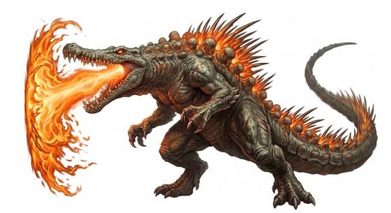

# Atomic sea lizard

{.illus}

*Set: Expansion*

*aka: ______________________________*

*[Reptilian](../Species_Families/reptilian.md) · gigantic biped · walk, swimmer · modern, sci-fi, superhero*

A towering reptile as tall as a city tower, scaled and dark, with rows of jagged plates down its back. It was sleeping in the deep sea until the great bomb tests woke it and changed it, and now it walks out of the ocean with radiation hissing from its hide.

When it is about to breathe, its back plates glow, brighter and brighter, and then it looses a searing ray that melts tanks and topples buildings. It flattens cities as it walks through them, ignores artillery and seems not even to notice aircraft. It has no fear and never flees. Most cities facing it only hope it will turn back to sea.

## Stat block

- **Attack** 24 (rerolls 1) · **Parry** — · **Dodge** 0 · **Armour** 6 · **Life** 66 · **Threat** 20++
- **Attacks (3 a round):** great bite 2d6+2; claws 2d6+1; tail 2d6+1
- **Attributes:** STR 30 DEX 7 AGI 7 END 30 INT 3 WIS 12 PER 12 CHA 10 COU 20
- **Skills:** [Swimming](../Skills/swimming.md) +5 (reroll 1), [Intimidation](../Skills/intimidation.md) +5 (reroll 3)
- **Powers:** [Radiation](../Powers/radiation.md) 4, [Energy Bolt](../Powers/energy-bolt.md) 5, [Healing Factor](../Powers/healing-factor.md) 3, [Invulnerability](../Powers/invulnerability.md) 3
- **Behaviour:** rises from the sea; flattens cities; ignores artillery. **Morale:** mindless, never flees.

How to read this block: [Bestiary](../bestiary.md).

## Not to be confused with

the *[trench-born colossus](trench-born-colossus.md)*, another giant from the ocean; the sea lizard is radioactive, breathes a ray and is a reptile.

