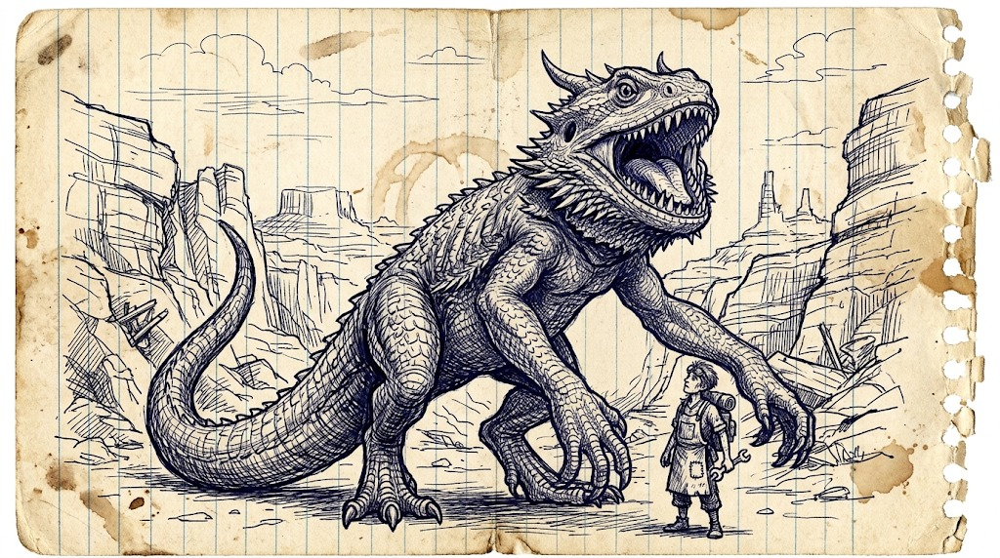

# Bearded drake

*Set: Expansion*

*aka: ______________________________*

*[Draconic](../Species_Families/draconic.md) · huge biped · ambusher · desert, canyon, fantasy, post-apocalyptic*

{.illus}

A wingless drake about fourteen feet tall that stalks upright on thick hindlegs, leaning forward on long, strong arms ready to grab. Its scales are the dull tan of canyon rock, and under its jaw hangs a ruff of spines, the beard it is named for. The beard flares wide and darkens when it is angry. It is a warning, and a creature that flares at you is already deciding how to kill you.

It does not run so much as lunge. A bearded drake will lie still for hours across a canyon road, then cross the gap faster than anything its size has a right to, seizing with both hands and biting with a mouth of long, crooked, meat-cutting teeth. It guards a nest ferociously. A sore tooth or a hungry belly makes it far more dangerous than a calm one, but it is not a mindless killer: a well-timed distraction can pull it off a road.

## Stat block

- **Attack** 22 (rerolls 1) · **Parry** — · **Dodge** 7 · **Armour** 2 · **Life** 46 · **Threat** 6
- **Attacks (3 a round):** great bite 2d6+2; grasping claws 2d6+1; second claw 1d6+3
- **Attributes:** STR 24 DEX 12 AGI 12 END 24 INT 3 WIS 12 PER 14 CHA 4 COU 15
- **Skills:** [Stealth](../Skills/stealth.md) +4, [Tracking](../Skills/tracking.md) +4
- **Powers:** [Toughness](../Powers/toughness.md) 3
- **Behaviour:** ambushes from a still posture; flares its beard before it strikes; guards nest and territory. **Morale:** fights to the death at its nest; elsewhere may be drawn off by a loud decoy.

How to read this block: [Bestiary](../bestiary.md).

## Not to be confused with

the *[great tyrant lizard](great-tyrant-lizard.md)*, a bigger, heavier hunter that crushes with its bite; the bearded drake is lighter, upright and grabs with its arms. Also the *[crag drake](crag-drake.md)*, a four-legged cliff ambusher.

