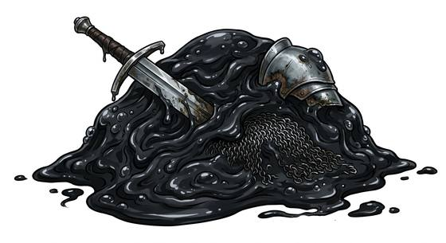

# Black acid pudding

{.illus}

*Set: Expansion*

*aka: ______________________________*

*[Amorphous and ooze](../Species_Families/amorphous-and-ooze.md) · large amorphous · slow · fantasy*

A heap of black, glistening jelly the size of a cart, quivering and oozing across the floor. It is corrosive: it dissolves wood, leather, metal and flesh, leaving smoking pits behind it.

It eats through armour in moments and flows under doors. It is mindless and never flees. Worst of all, when struck with blades it divides, each piece becoming a new, smaller pudding. Veterans fight it with fire, cold or blunt weapons, and never with a good sword. It is found in deep dungeons and sewers, cleaning them of anything that dies there.

## Stat block

- **Attack** 17 · **Parry** — · **Dodge** 0 · **Armour** 0 · **Life** 34 · **Threat** 1+
- **Attacks:** pseudopod 1d6+2
- **Attributes:** STR 18 DEX 4 AGI 4 END 20 INT 0 WIS 4 PER 4 CHA 0 COU 20
- **Skills:** [Climbing](../Skills/climbing.md) +3, [Stealth](../Skills/stealth.md) +3
- **Powers:** [Acid & Corrosion](../Powers/acid-and-corrosion.md) 4, [Duplication](../Powers/duplication.md) 2
- **Behaviour:** dissolves wood and metal; splits when cut. **Morale:** mindless, never flees.

How to read this block: [Bestiary](../bestiary.md).

## Not to be confused with

The *[Grey stone ooze](grey-stone-ooze.md)*, a smaller ooze that hides as damp rock; the black acid pudding is larger, corrosive, and splits when cut.

