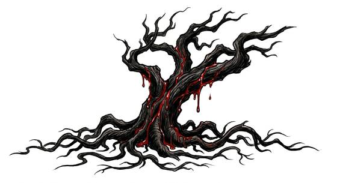

# Blood-drinking tree

{.illus}

*Set: Expansion*

*aka: ______________________________*

*[Plant-kind](../Species_Families/plant-kind.md) · huge plant · rooted · fantasy, horror, myth*

A gnarled tree with red sap and dark leaves, standing alone in a clearing or at a crossroads. It offers inviting shade, and travellers rest beneath it.

As they sleep, root-tendrils rise from the earth and draw their blood. Victims are found pale and dead in the morning. It is rooted and mindless and never flees. Burning it is the surest cure. Local folk warn travellers, and some mark such trees with red ribbons. The wood is said to be valuable to certain dark practitioners.

## Stat block

- **Attack** 20 · **Parry** — · **Dodge** 1 · **Armour** 2 · **Life** 42 · **Threat** 4+
- **Attacks (2 a round):** constrict 2d6
- **Attributes:** STR 24 DEX 6 AGI 6 END 24 INT 1 WIS 8 PER 8 CHA 1 COU 20
- **Skills:** [Stealth](../Skills/stealth.md) +4, [Wrestling & Grappling](../Weapon_Groups/wrestling-and-grappling.md) +5
- **Powers:** [Life Drain](../Powers/life-drain.md) 2, [Entangle](../Powers/entangle.md) 3
- **Behaviour:** shelters travellers; drinks their blood as they sleep. **Morale:** mindless, never flees.

How to read this block: [Bestiary](../bestiary.md).

## Not to be confused with

The *[Blighted walking tree](blighted-walking-tree.md)*, which uproots itself and rages; the blood-drinking tree stays rooted and feeds on sleepers.

