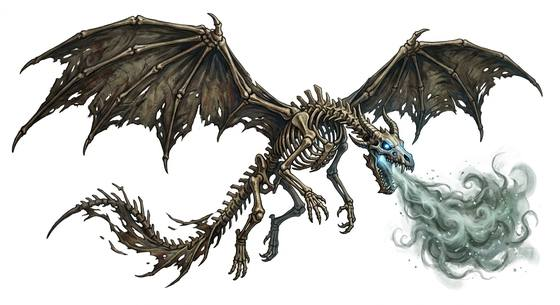

# Bone dragon

{.illus}

*Set: Expansion*

*aka: ______________________________*

*[Undead and deathless](../Species_Families/undead-and-deathless.md) · gigantic winged quadruped · flyer · fantasy, horror*

The skeleton of a dead dragon, raised by necromancy and flying on tattered, rotting wings that should not be able to hold it up. Its skull still has its teeth, and a cold, pale light burns in its eye sockets.

It breathes a freezing grave-cold that kills plants and rimes flesh with frost. Necromancers use bone dragons as flying siege beasts, sending them against castles and armies. It has no mind and never flees. The best weapons against it are heavy hammers and holy power, and the best time to strike is on the ground, before it gets into the air.

## Stat block

- **Attack** 24 (rerolls 1) · **Parry** — · **Dodge** 3 · **Armour** 3 · **Life** 50 · **Threat** 8+
- **Attacks (3 a round):** great bite 2d6+2; claws 2d6+1; tail 2d6+1
- **Attributes:** STR 28 DEX 10 AGI 10 END 24 INT 3 WIS 10 PER 14 CHA 2 COU 20
- **Skills:** [Intimidation](../Skills/intimidation.md) +5 (reroll 1)
- **Powers:** [Flight](../Powers/flight.md) 3, [Cold Blast](../Powers/cold-blast.md) 3, [Fear](../Powers/fear.md) 3
- **Behaviour:** serves a necromancer as a flying siege beast. **Morale:** mindless, never flees.

How to read this block: [Bestiary](../bestiary.md).

## Not to be confused with

the *[wild dragon beast](wild-dragon-beast.md)*, a living dragon of animal mind; the bone dragon is a dead skeleton that breathes cold.

