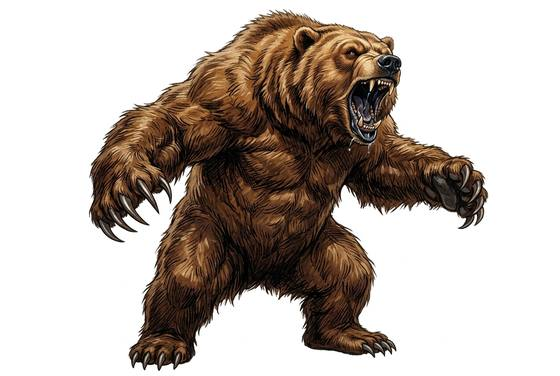

# Brown bear

{.illus}

*Set: Core*

*aka: ______________________________*

*[Ursine](../Species_Families/ursine.md) · large quadruped · walk · fantasy, historical, modern*

A huge, humped bear with a dished face, small eyes and claws as long as fingers. Brown bears roam forest, mountain and river valley, eating roots, berries, grubs, salmon and carrion, and taking a deer or a cow when the chance comes. Most of the year they want nothing more than to be left alone to eat.

The danger is surprise. A bear startled at close range, guarding a carcass or protecting cubs, charges with frightening speed and mauls with its claws and teeth. Its thick hide and heavy muscle shrug off blows that would stop a man. Travellers in bear country sing and bang pots as they walk, and hang their food high at night. A badly hurt bear usually retreats; one that does not is a hunter's worst day.

## Stat block

- **Attack** 20 · **Parry** — · **Dodge** 6 · **Armour** 1 · **Life** 28 · **Threat** 2
- **Attacks (2 a round):** smashing claws 2d6; bite 1d6+2
- **Attributes:** STR 20 DEX 10 AGI 10 END 18 INT 5 WIS 12 PER 12 CHA 8 COU 15
- **Skills:** [Foraging](../Skills/foraging.md) +5, [Intimidation](../Skills/intimidation.md) +5, [Swimming](../Skills/swimming.md) +3
- **Powers:** [Toughness](../Powers/toughness.md) 1
- **Behaviour:** defends cubs and kills; charges; mauls. **Morale:** flees when badly hurt.

How to read this block: [Bestiary](../bestiary.md).

## Not to be confused with

The *[Black Bear](black-bear.md)*, a smaller forest bear that climbs trees and usually bluffs and retreats rather than pressing a charge.

