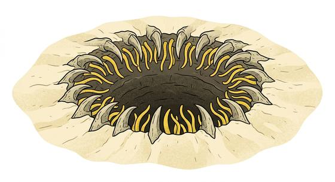

# Buried pit maw

{.illus}

*Set: Expansion*

*aka: ______________________________*

*[Cephalopod and mollusc](../Species_Families/cephalopod-and-mollusc.md) · gigantic other · immobile · sci-fi*

At the bottom of a sand pit in the deep desert lies a mouth. It is vast, ringed with a hooked beak and rows of inward-pointing teeth, and fringed with long, muscular tentacles that lie hidden beneath the sand around the rim. The creature itself never moves. It does not need to.

Anything that strays too near the edge is seized, dragged down the sliding slope and swallowed. What goes in is not killed quickly; its stomach dissolves prey over many years. Desert peoples use such pits for executions, and bandits dump their rivals there. It has no mind to reason with and nothing to fear. The only sure defence is staying well away from the rim.

## Stat block

- **Attack** 21 · **Parry** — · **Dodge** -3 · **Armour** 2 · **Life** 62 · **Threat** 6+
- **Attacks (3 a round):** great bite 2d6+2; tentacle lash 2d6+1
- **Attributes:** STR 28 DEX 4 AGI 4 END 26 INT 2 WIS 8 PER 11 CHA 2 COU 20
- **Skills:** [Camouflage](../Skills/camouflage.md) +5 (reroll 1)
- **Powers:** [Entangle](../Powers/entangle.md) 3, [Acid & Corrosion](../Powers/acid-and-corrosion.md) 3, [Toughness](../Powers/toughness.md) 4
- **Behaviour:** lies buried in sand; drags anything near the rim into its maw. **Morale:** mindless, never flees.

How to read this block: [Bestiary](../bestiary.md).

## Not to be confused with

the *[desert death worm](desert-death-worm.md)*, which roams under the sand and strikes where it pleases; the pit maw stays in one place and lets its prey come to it.

