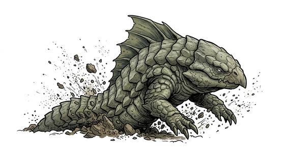

# Burrowing land-shark

{.illus}

*Set: Expansion*

*aka: ______________________________*

*[Reptilian](../Species_Families/reptilian.md) · large quadruped · burrower · fantasy*

A heavy, armour-plated hunter shaped like a shark with legs, that swims through soil the way a fish swims through water. Only a finned crest shows above the ground as it moves. It senses footsteps from far away, circles, and bursts up beneath the loudest one, jaws wide. It can leap high into the air and come down to crush its prey.

Farmers in its country learn to walk softly and keep their horses off open ground. It flees when badly hurt, and will not climb rock, so a boulder or a stone wall is the safest place to stand. Its plates make fine shields, if you can take them.

## Stat block

- **Attack** 21 · **Parry** — · **Dodge** 6 · **Armour** 2 · **Life** 32 · **Threat** 2
- **Attacks:** great bite 2d6; claws 1d6+2
- **Attributes:** STR 22 DEX 10 AGI 10 END 20 INT 2 WIS 11 PER 16 CHA 3 COU 17
- **Skills:** [Tracking](../Skills/tracking.md) +5, [Jumping](../Skills/jumping.md) +4
- **Powers:** [Burrowing](../Powers/burrowing.md) 3, [Enhanced Senses](../Powers/enhanced-senses.md) 2
- **Behaviour:** senses footsteps; bursts from the ground; leaps to crush. **Morale:** flees when badly hurt.

How to read this block: [Bestiary](../bestiary.md).

## Not to be confused with

*[Tremor-hunting worm](tremor-hunting-worm.md)*, which also hunts footsteps from below, but is blind and mindless and drags prey down with tongues instead of leaping to crush it.

