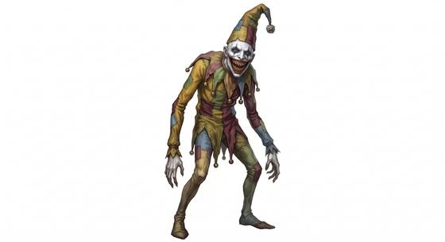

# Carnival clown horror

{.illus}

*Set: Expansion*

*aka: ______________________________*

*[Planar](../Species_Families/planar.md) · medium biped · teleports · sentient · horror, modern*

Something very old lives under the town, in drains and cellars and the dark space behind the funfair. It wakes every generation to feed, and it likes to wear a painted clown: white face, red grin, a fistful of balloons. It calls children by name, offers sweets and a peek at something wonderful, and then opens its mouth to show rows upon rows of teeth.

It feeds on terror as much as flesh, shaping itself into whatever each victim fears most, and it can be anywhere in its town at once. It cannot be killed by ordinary means. Yet when a band of people stand together and refuse to be afraid, it falters and slinks away to sleep for another long age, waiting for them to forget.

## Stat block

- **Attack** 19 · **Parry** — · **Dodge** 11 · **Armour** 0 · **Life** 22 · **Threat** 1+
- **Attacks:** inner jaw 1d6+1; claws 1d6+1
- **Attributes:** STR 13 DEX 14 AGI 14 END 14 INT 12 WIS 13 PER 13 CHA 12 COU 18
- **Skills:** [Deception](../Skills/deception.md) +5 (reroll 1), [Acting](../Skills/acting.md) +5 (reroll 1)
- **Powers:** [Mind Illusion](../Powers/mind-illusion.md) 3, [Self-Alteration](../Powers/self-alteration.md) 2, [Fear](../Powers/fear.md) 3
- **Behaviour:** lures children with gifts; feeds on terror. **Morale:** retreats to hibernate when defied.

How to read this block: [Bestiary](../bestiary.md).

## Not to be confused with

The *[Bedroom bogey](bedroom-bogey.md)*, a lurking thing that frightens one child at a time; the clown horror is ancient, feeds on a whole town and changes shape.

