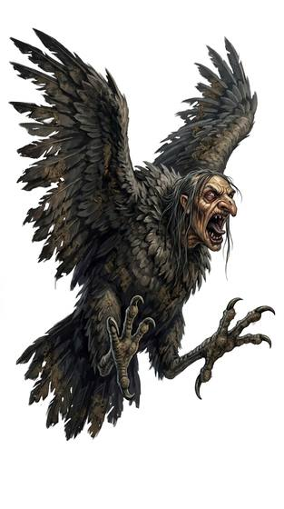

# Carrion harpy

{.illus}

*Set: Core*

*aka: ______________________________*

*[Avian](../Species_Families/avian.md) · medium winged biped · flyer · fantasy, myth, horror*

A vulture-bodied bird with a pinched, almost human face, grey and wrinkled like an old woman's, set above a hooked beak. It shrieks as it comes, a sound somewhere between a laugh and a curse. Carrion harpies descend on feasts, camps and market stalls in a filthy flurry, snatching bread, meat and the occasional small child or pet, and they foul whatever they cannot carry off.

Food they have touched is spoiled and breeds sickness, and wounds from their talons fester. They are cowards at heart and fly off screaming once badly hurt. Sailors and shepherds nail up bright rags and bells to keep them away, with mixed success.

## Stat block

- **Attack** 15 · **Parry** — · **Dodge** 12 · **Armour** 1 · **Life** 16 · **Threat** minor+
- **Attacks:** talons 1d6+1; beak 1d6
- **Attributes:** STR 10 DEX 15 AGI 15 END 12 INT 4 WIS 9 PER 13 CHA 3 COU 11
- **Skills:**, [Stealth](../Skills/stealth.md) +3, [Intimidation](../Skills/intimidation.md) +3
- **Powers:** [Flight](../Powers/flight.md) 3, [Disease](../Powers/disease.md) 1
- **Behaviour:** snatches food and small victims; fouls what it leaves. **Morale:** flees when badly hurt.

How to read this block: [Bestiary](../bestiary.md).

## Not to be confused with

*[harpy-kind](../Species/avian-harpy-kind.md)*, the thinking, speaking bird-women of legend; the carrion harpy is a dirty, mindless scavenger with only a face that looks human.

