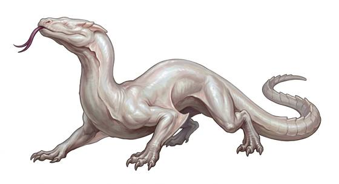

# Cave drake

{.illus}

*Set: Expansion*

*aka: ______________________________*

*[Draconic](../Species_Families/draconic.md) · large quadruped · walk, climber · fantasy, horror*

A pale, eyeless drake of the deep caverns, long-bodied and wingless, with hooked claws that let it cling to the roof like a bat. Its skin is the colour of candle wax. It has no eyes at all, but it hears a whisper across a cavern and smells a living body from far off.

It hunts by clinging to the ceiling above tunnels and dropping on whatever passes, and it is drawn above all to light, which to it means warmth and food. It flees when badly hurt. Miners and cave explorers learn to shade their lamps and walk softly. Its lair is littered with bones and old, crushed lanterns.

## Stat block

- **Attack** 18 · **Parry** — · **Dodge** 8 · **Armour** 2 · **Life** 30 · **Threat** 3
- **Attacks (2 a round):** great bite 2d6; claws 1d6+2
- **Attributes:** STR 17 DEX 12 AGI 12 END 18 INT 3 WIS 12 PER 16 CHA 4 COU 14
- **Skills:** [Climbing](../Skills/climbing.md) +5, [Survival: Caves & Underground](../Skills/survival-caves-and-underground.md) +5
- **Powers:** [Radar Sense](../Powers/radar-sense.md) 3, [Night & Spectrum Sight](../Powers/night-and-spectrum-sight.md) 3
- **Behaviour:** blind hunter; clings to cavern roofs and drops on light. **Morale:** flees when badly hurt.

How to read this block: [Bestiary](../bestiary.md).

## Not to be confused with

the *[Blind Cave Crawler](blind-cave-crawler.md)*, a smaller blind hunter of the deeps; the cave drake is a true drake that drops from the roof.

