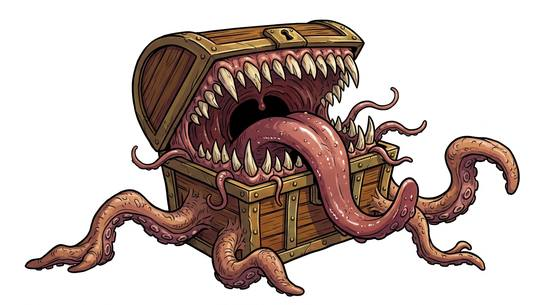

# Chest-shaped lurker

{.illus}

*Set: Expansion*

*aka: ______________________________*

*[Amorphous and ooze](../Species_Families/amorphous-and-ooze.md) · medium amorphous · slow · fantasy*

The chest at the end of the dungeon corridor, iron-bound, with a heavy lid. It is exactly what an adventurer hopes to find. It is also a predator that has learned what adventurers want. Its skin is sticky as glue, its lid hides a mouth of teeth, and a long tongue lurks inside.

It waits for greedy hands. Whoever touches it sticks fast, and the lid snaps down. It is slow to move and prefers to stay put. When badly hurt it lets go and shuffles away. Some can be bribed with food and will even talk, after a fashion. Veterans poke every chest with a long pole before opening it, and never trust a chest in an empty room.

## Stat block

- **Attack** 16 · **Parry** — · **Dodge** 3 · **Armour** 2 · **Life** 22 · **Threat** 1+
- **Attacks:** great bite 1d6+2
- **Attributes:** STR 16 DEX 6 AGI 6 END 16 INT 3 WIS 10 PER 10 CHA 1 COU 14
- **Skills:** [Stealth](../Skills/stealth.md) +5 (reroll 1), [Deception](../Skills/deception.md) +3
- **Powers:** Disguise (power) 4, [Entangle](../Powers/entangle.md) 2
- **Behaviour:** waits as a treasure chest; glues and bites the greedy. **Morale:** flees when badly hurt.

How to read this block: [Bestiary](../bestiary.md).

## Not to be confused with

The *[Doorway lurker](doorway-lurker.md)*, a larger mimic that poses as doors and walls; the chest-shaped lurker is chest-sized and baits the greedy.

