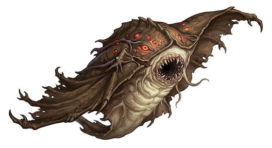

# Cloak-winged lurker

{.illus}

*Set: Expansion*

*aka: ______________________________*

*[Aquatic](../Species_Families/aquatic.md) · large flyer · flyer · sentient · fantasy, horror*

A manta-shaped horror as wide as a man's outstretched arms, dark and leathery. It hangs still on a hook or against a wall, and looks exactly like an old cloak. When someone passes close, it spreads its wings, flies, and wraps around its victim, biting with a mouth hidden in its underside.

While it feeds it moans, a low, wavering sound that spreads panic in anyone who hears it. It flees when badly hurt. Old hands in the dark country never pick up a cloak they didn't bring. A friend wrapped in one needs help fast, and a careful blade.

## Stat block

- **Attack** 18 · **Parry** — · **Dodge** 10 · **Armour** 1 · **Life** 24 · **Threat** 2+
- **Attacks (2 a round):** bite 1d6+2; tail 1d6+2
- **Attributes:** STR 14 DEX 14 AGI 14 END 14 INT 12 WIS 13 PER 18 CHA 8 COU 14
- **Skills:** [Stealth](../Skills/stealth.md) +5 (reroll 2)
- **Powers:** [Flight](../Powers/flight.md) 2, [Mirror Images](../Powers/mirror-images.md) 2, [Fear](../Powers/fear.md) 2, [Shadow Shaping](../Powers/shadow-shaping.md) 2
- **Behaviour:** hangs like a cloak; wraps a victim; moans to terrify. **Morale:** flees when badly hurt.

How to read this block: [Bestiary](../bestiary.md).

## Not to be confused with

*[Ceiling smotherer](ceiling-smotherer.md)*, a rock-like sheet that crushes, where the cloak-winged lurker flies, bites and moans to terrify.

