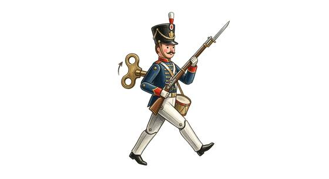

# Clockwork soldier

{.illus}

*Set: Expansion*

*aka: ______________________________*

*[Constructs and synthetics](../Species_Families/constructs-and-synthetics.md) · medium biped · walk · fantasy, historical*

A wind-up soldier of tin and brass, man-sized, painted in bright uniform colours, with a blade or a spear built into its arm. It marches in ranks, holds a line and cuts. That is all it knows. It follows orders to the letter and does exactly what it was told, nothing more.

It never flees and never breaks. It is also easy to confuse: an order that no longer fits the battle is still obeyed, and a clever foe can lead a whole rank into a ditch. Kingdoms of engineers keep companies of them as guards and parade troops, and a few wars have been fought with them, to everyone's discomfort.

## Stat block

- **Attack** 19 · **Parry** 16 · **Dodge** 8 · **Armour** 2 · **Life** 19 · **Threat** 2
- **Attacks:** blade arms 1d6+1
- **Attributes:** STR 14 DEX 11 AGI 11 END 14 INT 2 WIS 8 PER 8 CHA 1 COU 20
- **Skills:** [Formation Fighting](../Skills/formation-fighting.md) +4, [Swords](../Weapon_Groups/swords.md) +3
- **Powers:** —
- **Behaviour:** marches in ranks; follows its orders literally. **Morale:** mindless, never flees.

How to read this block: [Bestiary](../bestiary.md).

## Not to be confused with

The *[Sentry robot](sentry-robot.md)*, a later guard machine with guns and sensors; the clockwork soldier is a wind-up automaton drilled only to march and cut.

