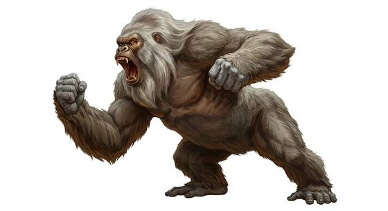

# Colossal ape

{.illus}

*Set: Expansion*

*aka: ______________________________*

*[Simian](../Species_Families/simian.md) · gigantic biped · walk, climber · modern, fantasy, historical*

A gorilla-like ape taller than a lighthouse, with a shaggy dark coat, a scarred chest and hands that can pull up trees. It rules a lost island somewhere beyond the charts, where the natives build great walls to keep it out and leave offerings at the gate.

It is clever by animal standards: it learns, remembers and can be curious, even gentle, with something small that catches its interest. But it is fiercely territorial, and it wrestles every giant beast that comes onto its island. Taken from home, it climbs the tallest towers in the city it is brought to and fights to the death against whatever comes up after it.

## Stat block

- **Attack** 25 (rerolls 1) · **Parry** — · **Dodge** 5 · **Armour** 2 · **Life** 66 · **Threat** 6
- **Attacks (3 a round):** smashing claws 2d6+2; great bite 2d6+2
- **Attributes:** STR 30 DEX 12 AGI 12 END 28 INT 8 WIS 12 PER 12 CHA 8 COU 18
- **Skills:** [Climbing](../Skills/climbing.md) +5 (reroll 2), [Brawling](../Weapon_Groups/brawling.md) +5 (reroll 1), [Intimidation](../Skills/intimidation.md) +5 (reroll 1)
- **Powers:** [Toughness](../Powers/toughness.md) 4
- **Behaviour:** rules a lost island; climbs towers; wrestles other giants. **Morale:** fights to the death.

How to read this block: [Bestiary](../bestiary.md).

## Not to be confused with

the *[giant ape](giant-ape.md)*, an ancient animal a little larger than a gorilla; the colossal ape is tall enough to climb towers.

